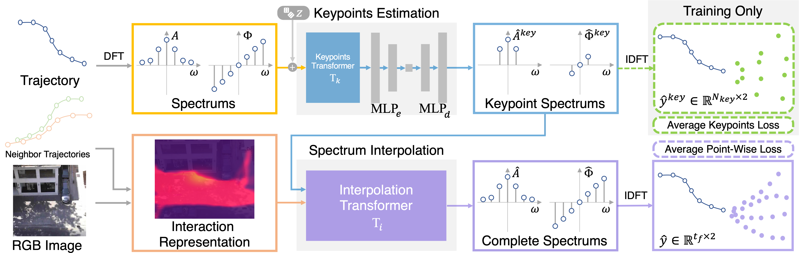

<!--
 * @Author: Conghao Wong
 * @Date: 2023-03-21 17:52:21
 * @LastEditors: Conghao Wong
 * @LastEditTime: 2023-04-13 18:08:00
 * @Description: file content
 * @Github: https://cocoon2wong.github.io
 * Copyright 2023 Conghao Wong, All Rights Reserved.
-->

<link rel="stylesheet" type="text/css" href="./assets/css/user.css">

## Information

This is the homepage of our ECCV2022 paper "View vertically: A hierarchical network for trajectory prediction via fourier spectrums".
The paper is publicly available on arXiv.
Click the buttons below for more information.

<div style="text-align: center;">
    <a class="btn btn-colorful btn-lg get-started-btn" href="https://arxiv.org/abs/2110.07288">📖 Paper</a>
    <a class="btn btn-colorful btn-lg" href="https://github.com/cocoon2wong/Vertical">🛠️ Codes</a>
    <a class="btn btn-colorful btn-lg" href="./howToUse">💡 Codes Guidelines</a>
</div>

## Abstract

<div style="text-align: center;">
    
</div>

Understanding and forecasting future trajectories of agents are critical for behavior analysis, robot navigation, autonomous cars, and other related applications.
Previous methods mostly treat trajectory prediction as time sequence generation.
Different from them, this work studies agents' trajectories in a "vertical" view, i.e., modeling and forecasting trajectories from the spectral domain.
Different frequency bands in the trajectory spectrums could hierarchically reflect agents' motion preferences at different scales.
The low-frequency and high-frequency portions could represent their coarse motion trends and fine motion variations, respectively.
Accordingly, we propose a hierarchical network V$^2$-Net, which contains two sub-networks, to hierarchically model and predict agents' trajectories with trajectory spectrums.
The coarse-level keypoints estimation sub-network first predicts the "minimal" spectrums of agents' trajectories on several "key" frequency portions.
Then the fine-level spectrum interpolation sub-network interpolates the spectrums to reconstruct the final predictions.
Experimental results display the competitiveness and superiority of V$^2$-Net on both ETH-UCY benchmark and the Stanford Drone Dataset.

## Citation

If you find this work useful, it would be grateful to cite our paper!

```bib
@inproceedings{wong2022view,
  title={View Vertically: A hierarchical network for trajectory prediction via fourier spectrums},
  author={Wong, Conghao and Xia, Beihao and Hong, Ziming and Peng, Qinmu and Yuan, Wei and Cao, Qiong and Yang, Yibo and You, Xinge},
  booktitle={European Conference on Computer Vision},
  pages={682--700},
  year={2022},
  organization={Springer}
}
```

## Contact us

Conghao Wong ([@cocoon2wong](https://github.com/cocoon2wong)): conghaowong@icloud.com  
Beihao Xia ([@NorthOcean](https://github.com/NorthOcean)): xbh_hust@hust.edu.cn
